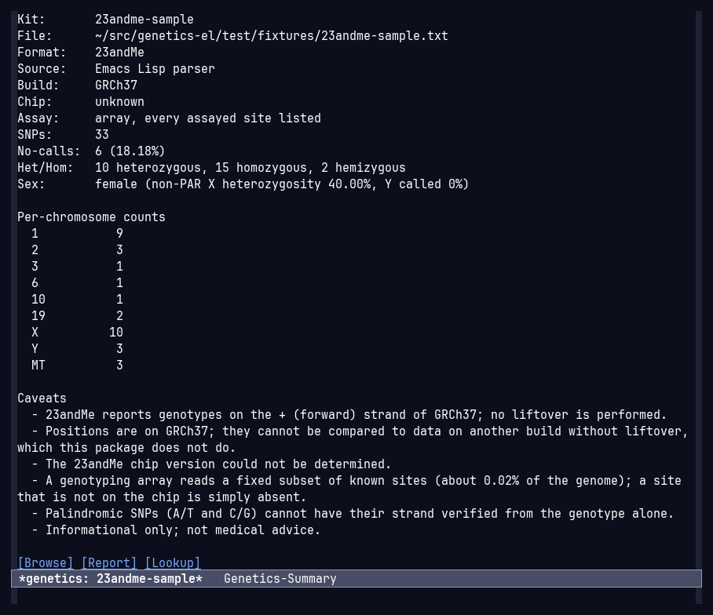
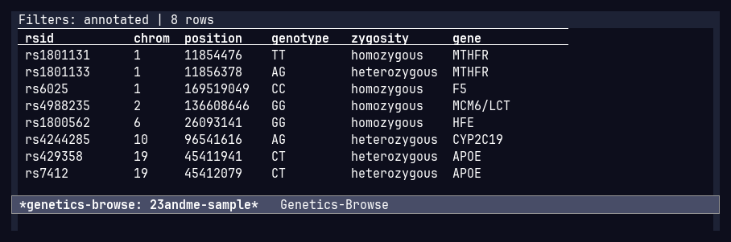
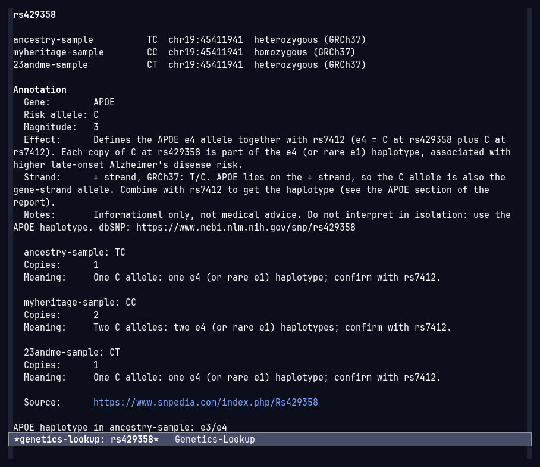
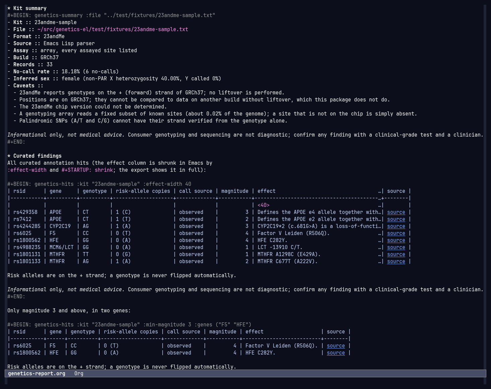

# genetics.el

Read, browse, annotate, compare and report on consumer genetics raw-data
exports inside Emacs. Everything runs locally; there is no network code
except an opt-in, rsid-only SNPedia lookup (see [Privacy](#privacy)).

Files are read through a swappable source layer: the
[genome-cli](https://github.com/davidawad/genome-cli) executable (`genome`)
when it is installed, otherwise the package's own Emacs Lisp parser. See
[Sources](#sources-genome-cli-or-the-native-parser).

> Informational only, not medical advice. Consumer genotyping arrays and
> consumer sequencing are not diagnostic. Confirm any finding with a
> clinical-grade test and a clinician.

| Summary buffer | Filterable browser |
|:--:|:--:|
| [](docs/screenshots/summary.png) | [](docs/screenshots/browse.png) |
| `M-x genetics-open`: format, build, no-call rate, inferred sex, per-chromosome counts and strand/build caveats. | `M-x genetics-browse`, then `a`: the records of the kit filtered to curated SNPs (filters in the header line). |
| **Lookup buffer** | **Org report from dynamic blocks** |
| [](docs/screenshots/lookup.png) | [](docs/screenshots/org-report.png) |
| `M-x genetics-lookup RET rs429358`: the call in every loaded kit, the curated annotation and its meaning per kit. | [`examples/genetics-report.org`](examples/genetics-report.org) ([HTML export](examples/genetics-report.html)): `genetics-summary`, `genetics-hits` and `genetics-apoe` blocks. |

Every screenshot is real Emacs (`emacs -Q`, `modus-vivendi-tinted`,
JetBrains Mono) under Xvfb, showing **synthetic** fixtures only:
[`test/fixtures/23andme-sample.txt`](test/fixtures/23andme-sample.txt),
[`myheritage-sample.csv`](test/fixtures/myheritage-sample.csv) and
[`ancestry-sample.txt`](test/fixtures/ancestry-sample.txt). Regenerate them
with [`examples/screenshots.sh`](examples/screenshots.sh) (driver:
[`examples/screenshots.el`](examples/screenshots.el)); the sample report
alone with `emacs -Q --batch -l examples/regenerate-report.el`.

### What it reads

| Input | Example | Status |
|-------|---------|--------|
| Genotyping arrays | 23andMe, AncestryDNA, MyHeritage, FamilyTreeDNA | Supported (a fixed ~0.02% of the genome) |
| Whole-genome VCF | Nucleus `.vcf.gz`, GRCh37/GRCh38, with or without rsids | **Primary format**; multi-GB files offset-indexed; absent sites labelled *inferred* |
| FASTQ reads | `R1.fastq.gz` + `R2.fastq.gz` | Via [genome-cli](https://github.com/davidawad/genome-cli) `genome pipeline` → VCF |
| BAM/CRAM, PDF/Promethease reports | | Not read (detected and explained) |

Details: [What is supported, and what is not](#what-is-supported-and-what-is-not).

### 60-second usage

```elisp
M-x genetics-open RET ~/dna/genome.txt RET   ; parse + summary buffer
M-x genetics-browse                          ; table; c/p/s/g/n/h/o/a filter, x clears
M-x genetics-lookup RET rs1801133 RET        ; one SNP in every loaded kit
M-x genetics-report                          ; Org report (C-u: also save it)
M-x genetics-compare                         ; concordance of two loaded kits
M-x genetics-fastq-plan RET R1.fastq.gz ...  ; what genome-cli would run
M-x genetics-fastq-run                       ; plan, confirm, run async
```

Or report from any Org file (`C-c C-x C-u` on a block fills it):

```org
#+BEGIN: genetics-summary :file "~/dna/genome.txt"
#+END:
#+BEGIN: genetics-hits :kit "genome" :min-magnitude 2
#+END:
#+BEGIN: genetics-apoe :kit "genome"
#+END:
```

`genetics-open` prompts starting in `genetics-data-directory`.

## Overview

- Auto-detects and parses 23andMe, AncestryDNA, MyHeritage / FamilyTreeDNA
  CSV and VCF (plain and `.vcf.gz`), natively or through genome-cli.
- Whole-genome VCFs without rsids (`.` in every ID) get curated annotations,
  the APOE section and the report by matching **per-build coordinates**
  (GRCh37 and GRCh38, verified against dbSNP and Ensembl).
- Variant-only WGS VCFs: a curated site that is absent is shown as
  homozygous reference **inferred**, always labelled as such, never as
  observed.
- FASTQ reads are not parsed; `genetics-fastq-plan` / `genetics-fastq-run`
  drive `genome pipeline` to turn them into a VCF.
- Multi-GB VCFs are never loaded: above a size limit the file is
  offset-indexed (rsid -> byte offset, per-chromosome ranges) and records are
  read lazily by seeking.
- Summary buffer with SNP count, no-call rate, heterozygous/homozygous counts,
  per-chromosome counts (alt/decoy/HLA/unplaced contigs folded into one
  "other contigs (N)" row), inferred sex (pseudoautosomal regions excluded)
  and strand/build caveats.
- Filterable tabulated browser, single-rsid lookup, annotation layer (JSON or
  Org), Org report with APOE haplotype, kit-to-kit comparison, CSV/JSON export.
- Org dynamic blocks (`genetics-summary`, `genetics-hits`, `genetics-apoe`)
  to put a kit's summary, curated hits and APOE result in any Org document.

## Install

Requires Emacs 29.1 or newer on Linux, macOS or Windows (native Windows
Emacs; WSL works too). Nothing else is required: `gzip` and genome-cli are
optional, and external programs are found with `executable-find` (so
`gzip.exe` / `genome.exe` work on Windows) and run with argument lists,
never through a shell. Native JSON (libjansson on Emacs 29, built in on 30)
is used when present; Emacs 29 builds without it fall back to `json.el`.

### Requirements per OS

| | Emacs | gzip (optional) | genome-cli (optional) |
|-|-------|-----------------|-----------------------|
| Debian/Ubuntu | `sudo apt install emacs` | preinstalled (`sudo apt install gzip`) | see [genome-cli](https://github.com/davidawad/genome-cli) |
| Fedora | `sudo dnf install emacs` | preinstalled (`sudo dnf install gzip`) | as above |
| Arch | `sudo pacman -S emacs` | preinstalled (`sudo pacman -S gzip`) | as above |
| macOS (Homebrew) | `brew install --cask emacs` | preinstalled (`/usr/bin/gzip`) | as above |
| Windows | `winget install GNU.Emacs`, `choco install emacs` or `scoop install extras/emacs` | `scoop install gzip`, `choco install gzip`, or Git for Windows' `C:/Program Files/Git/usr/bin/gzip.exe` (set `genetics-gzip-program` to that path); or none, see below | `genome.exe` on `PATH`, or set `genetics-genome-executable` |

genetics.el draws no charts: it does not use gnuplot, Vega (`vl2svg` /
`vl2png`), `rsvg-convert` or Emacs' SVG/librsvg support, so builds without
image support (including `emacs -nw` and Windows builds without librsvg) lose
nothing. The README screenshots come from `examples/screenshots.sh`, a
Linux/X11-only maintainer script (Xvfb, xwd, ImageMagick).

### What degrades without each tool

| Missing | Effect |
|---------|--------|
| `gzip` | `.vcf.gz` is decompressed by Emacs' own zlib when the build has it (standard Linux, Homebrew and GNU Windows builds do; check with `M-: (zlib-available-p)`). Plain gzip and BGZF (`bgzip`/tabix) files work; the whole compressed file is read into memory, and a multi-member file that is not BGZF is refused with `genetics-gzip-error`. Set `genetics-gzip-program` to `nil` to always use zlib. |
| `gzip` and zlib | Opening a `.gz` signals `genetics-gzip-error`: install gzip, use genome-cli, or decompress the file first. Uncompressed files are unaffected. |
| genome-cli | `genetics-source-auto` uses the native parser for every file; only the FASTQ commands (`genetics-fastq-plan`/`-run`) need it and say so (`genetics-genome-missing`). |
| `sh` (tests only) | The genome-cli tests use a fake `genome` sh script (`genome.cmd` shim on Windows, run with Git for Windows' `sh.exe`); without `sh` they are skipped. |

Files the package writes (exports, reports, caches, SNPedia answers) are
always UTF-8 with LF line endings; input with CRLF line endings (files that
passed through Windows) reads the same as LF. `genetics-data-directory`
defaults to `~/Documents/Genetics/` when it exists, and to `~/` otherwise; if the configured directory is missing (a configuration
shared between machines), prompts start in `default-directory`.

With straight.el:

```elisp
(use-package genetics
  :straight (genetics :host github :repo "davidawad/genetics.el")
  :commands (genetics-open genetics-browse genetics-lookup
             genetics-report genetics-compare))
```

or from a local checkout:

```elisp
(use-package genetics
  :load-path "~/src/genetics.el"
  :commands (genetics-open genetics-browse genetics-lookup
             genetics-report genetics-compare))
```

or, with `package-vc` (Emacs 29+):

```elisp
(package-vc-install "https://github.com/davidawad/genetics.el")
```

## What is supported, and what is not

Consumer genetics produces several very different kinds of file. Only
*genotype* files (one call per position) can be read; raw sequencer reads
must first be turned into a VCF, and finished reports cannot be read at all.

| File | What it is | Status |
|------|------------|--------|
| Whole-genome VCF (`.vcf` / `.vcf.gz`), e.g. Nucleus | Variant calls from sequencing the whole genome, usually GRCh38, often `.` in every ID and variant sites only | **Primary format.** Opening, summary, browsing and offset-indexed large files verified on a ~430 MB whole-genome VCF (5.1M records, ~30 s to index natively). Curated annotations, APOE and the report now work by GRCh37/GRCh38 position, with absent sites shown as *inferred* homozygous reference when the file is variant-only; this part is tested on synthetic files only. |
| 23andMe raw data `.txt` | Genotyping-array calls at ~600k known SNPs, keyed by rsid, GRCh37 | **Supported, a subset.** Verified on a v5 kit export (~640k SNPs, ~19 s to parse natively). An array reads a fixed ~0.02% of the genome, so a site not on the chip is just absent. |
| AncestryDNA / MyHeritage / FamilyTreeDNA raw data | Same kind of array data, different column layouts | Supported, a subset; tested on synthetic fixtures only |
| FASTQ (`.fastq`, `.fq`, `.gz`) | Raw sequencer reads (tens of GB), no genotypes yet | **Via the genome-cli pipeline.** `genetics-open` detects FASTQ and explains instead of failing. `genetics-fastq-plan` shows what `genome pipeline plan` would run (reference fetch, alignment, sorting, duplicate marking, variant calling, filtering, normalization); `genetics-fastq-run` runs it asynchronously and offers to open the resulting VCF. If your provider already gave you a VCF (Nucleus does), open that instead. Tested against a fake `genome` only. |
| BAM / CRAM / SAM | Aligned reads | Not supported; detected and explained (variant-call to a VCF first) |
| Promethease exports, 23andMe ancestry/haplogroup reports, family-tree JSON, PDF reports | Interpretations derived from the raw data | Not supported; these are outputs, not inputs |

Remaining limits:

- **Different builds, no liftover in Emacs.** Nucleus is GRCh38 and 23andMe
  is GRCh37. The curated SNPs carry both coordinates, but
  `genetics-compare` between two natively parsed kits on different builds
  still matches by id and warns. genome-cli's `compare` may lift over; when
  it does, its warnings are shown.
- **Inferred is not observed.** "Homozygous reference (inferred)" means the
  site is not in a variant-only VCF. A site the sequencer did not cover looks
  the same. Inference is only made on chromosomes 1-22, only when the kit is
  known to be variant-only (see `genetics-vcf-ref-calls`), only if the
  chromosome has records, and never when a deletion in the file spans the
  site.
- **Large-file mode** (native parser, above `genetics-vcf-eager-limit`)
  skips no-call, heterozygosity and sex statistics. genome-cli computes them
  for any size.

## How the formats differ

| | Genotyping array (23andMe, AncestryDNA, ...) | Whole-genome VCF (Nucleus, ...) | FASTQ |
|---|---|---|---|
| Content | one call per assayed SNP | one line per site that differs from the reference (variant-only), or per covered block (gVCF) | raw reads, no calls |
| Coverage | fixed ~600k known sites | the whole genome (~4-5M variant sites per person) | the whole genome, unprocessed |
| Identifiers | rsids (plus vendor `i` ids) | often `.`; sites are identified by chromosome and position | none |
| Build | GRCh37 | usually GRCh38 | none until aligned |
| Absent site means | not on the chip (unknown) | most likely homozygous reference (`absent-means-ref`) | n/a |
| No-calls | `--` | `./.` (rare in variant-only files) | n/a |
| Contigs | 1-22, X, Y, XY (PAR), MT | 1-22, X, Y, M plus thousands of alt, decoy, HLA and unplaced contigs | n/a |
| Strand | + strand of GRCh37 | relative to REF of its own build (+ strand) | n/a |

The kit model records this: `assay` (`array`, `wgs`, ...), `ref-calls`
(`explicit` when every assayed site is listed, `absent-means-ref` for
variant-only WGS, `unknown`) and whether the file has rsids. The summary and
report state each, and the caveats explain what follows from them.

For natively parsed VCFs, `genetics-vcf-ref-calls` decides `ref-calls`:
`auto` (default) treats a gVCF as `explicit`, and a VCF with no explicit
`0/0` calls and at least `genetics-wgs-min-records` records (1,000,000) as
`absent-means-ref`; anything else is `unknown`, which never infers. Pass
`:ref-calls 'absent-means-ref` to `genetics-parse-file`, or set the
variable, for a smaller variant-only file. genome-cli reports `ref_calls`
itself.

## Sources: genome-cli or the native parser

`genetics-source-function` turns a file into a kit:

| Value | Behaviour |
|-------|-----------|
| `genetics-source-auto` (default) | genome-cli when `genetics-genome-executable` is found, else native |
| `genetics-source-genome-cli` | always genome-cli; signals `genetics-genome-missing` if it is not installed |
| `genetics-source-native` | the Emacs Lisp parser (fine for array files and small VCFs) |

Both produce the same `genetics-kit` / `genetics-snp` structures, so browse,
lookup, report, compare and export work on either. With genome-cli the
records stay in genome-cli and are fetched on demand; the summary buffer
says which source a kit came from.

genome-cli is called synchronously with `--format json`, and every answer is
a `genome/v1` envelope (`{"schema":"genome/v1","kind":...,"data":[...],
"warnings":[...]}`; errors are `{"ok":false,"error":{"code","message"}}` with
a nonzero exit, signalled as `genetics-genome-error`). Commands used:

| Purpose | argv | kind |
|---------|------|------|
| open a file | `genome import FILE --format json` | `kits` |
| summary, sex, caveats | `genome summary --kit ID --format json` | `summary` |
| one SNP (rsid or curated position, with `call_source`) | `genome lookup --kit ID --rsid RSID --format json` | `genotypes` |
| browse / export a chromosome, records at a position | `genome query --kit ID --chrom C [--start S --end E] --limit N --offset M --format json` | `genotypes` |
| compare two genome-cli kits | `genome compare ID-A ID-B --format json` | `compare` |
| FASTQ plan / run | `genome pipeline plan\|run FASTQ... --build B [--out DIR] --format json` | `pipeline-plan` / `pipeline-run` |

Pure `-explain` twins return the exact command line without running it:
`genetics-source-genome-cli-explain`, `genetics-fastq-plan-explain`,
`genetics-fastq-run-explain` (and `genetics-genome-argv` for the rest).

`call_source` from genome-cli is respected: `observed` is a normal call,
`inferred_ref` becomes an inferred call (labelled "(inferred ref)"),
`missing` means not present. Comparing a genome-cli kit with a natively
parsed one is refused with an error rather than done badly.

## Supported formats

Detection looks at header comments and columns, not the file extension
(the extension is used only to recognise FASTQ, BAM/CRAM/SAM and `.gz`).

| Format | Example | Notes |
|--------|---------|-------|
| 23andMe `.txt` | `rs4477212<TAB>1<TAB>82154<TAB>AA` | `#` comments; build read from "build 37"; chip v3/v4/v5 from a header hint or SNP count (about 960k / 570k / 630k), otherwise `unknown`; `--` is a no-call; single letters on X/Y/MT are hemizygous |
| AncestryDNA `.txt` | `rs4477212<TAB>1<TAB>82154<TAB>A<TAB>A` | chromosomes 23/24/25/26 become X/Y/XY/MT; `0` alleles are no-calls |
| MyHeritage CSV | `"rs4477212","1","82154","AA"` | `RSID,CHROMOSOME,POSITION,RESULT`, `#` comments mentioning MyHeritage |
| FamilyTreeDNA CSV | `"rs4477212","1","82154","AA"` | same columns, no comments (build 37 assumed, and flagged as assumed) |
| VCF / VCF.gz | `chr1 82154 rs4477212 A G . . . GT 0/1` | `GT` converted to letters (`0/1` -> `AG`, phased, multi-allelic, `./.` -> no-call, haploid); `chr` prefix removed; `.` ids stored as `chrom:pos`; build from `##reference` / `##contig` |

Genotypes are stored as upper-case letters (`AG`), `--` for a no-call. VCF
indels use `/` between alleles (`AT/A`). Comparison and filters are
order-insensitive (`AG` equals `GA`).

### Large VCFs

When a VCF is larger than `genetics-vcf-eager-limit` (200 MB by default) it is
indexed in chunks of `genetics-chunk-size` bytes without keeping records.
`.vcf.gz` above the limit is decompressed once into `genetics-cache-directory`
and indexed there. A sparse position index (every 256th record) lets
position lookups seek instead of scanning. Lookups, browsing a chromosome,
curated annotations and comparison work on such kits; the no-call and
heterozygosity statistics and sex inference are not computed for them.

### Summary details

- Per-chromosome counts list 1-22, X, Y, XY and MT; every other contig
  (alt, decoy, HLA, unplaced, EBV, ...) is folded into one
  `other contigs (N)` row, N being the number of such contigs.
- Sex is inferred from X heterozygosity *outside the pseudoautosomal
  regions* (GRCh37 X:60001-2699520 and X:154931044-155260560; GRCh38
  X:10001-2781479 and X:155701383-156030895; both builds' regions when the
  build is unknown) combined with the Y call rate. Arrays: male when at
  least 50% of Y sites are called and non-PAR X heterozygosity is under 5%;
  female when X heterozygosity is 5% or more and under 20% of Y sites are
  called; otherwise uncertain. Variant-only WGS VCFs list only called sites,
  so the Y call rate means nothing there: male under 15% X heterozygosity
  with any Y calls, female at 30% or more. genome-cli kits show genome-cli's
  call and method.

## Commands and keys

| Command | Purpose |
|---------|---------|
| `genetics-open` | Parse a file, register the kit, show the summary |
| `genetics-summary` | Show the summary buffer of a kit |
| `genetics-close` | Unload a kit |
| `genetics-browse` | Filterable table of records |
| `genetics-lookup` | Detail for one rsid across loaded kits |
| `genetics-report` | Org report (prefix argument: also write a file) |
| `genetics-compare` | Concordance between two kits |
| `genetics-export-csv`, `genetics-export-json` | Export all records, or the browser's filtered view |
| `genetics-reload-annotations` | Re-read annotation files |
| `genetics-fastq-plan` | Show `genome pipeline plan` for FASTQ reads (one file or an R1/R2 pair) |
| `genetics-fastq-run` | Show the plan, confirm, run `genome pipeline run` asynchronously; offer to open the VCF |
| `genetics-fastq-plan-explain`, `genetics-fastq-run-explain`, `genetics-source-genome-cli-explain` | Show the exact genome-cli command without running it |
| `genetics-org-insert-block` | Insert and fill a `genetics-summary` / `genetics-hits` / `genetics-apoe` Org dynamic block |
| `genetics-org-explain-block` | Say what the genetics dynamic block at point would read and insert, without running it |

Summary buffer (`genetics-summary-mode`): `b` browse, `r` report, `l` lookup,
`c` compare, `g` refresh; buttons for the same.

Browser (`genetics-browse-mode`, derived from `tabulated-list-mode`):

| Key | Command |
|-----|---------|
| `RET` | lookup the rsid at point |
| `c` | filter chromosome |
| `p` | filter position range |
| `s` | filter rsid by regexp |
| `g` | filter genotype (order-insensitive) |
| `n` / `h` / `o` | no-calls only / heterozygous only / homozygous only |
| `a` | toggle annotated only |
| `x` | clear all filters |
| `E` / `J` | export current view to CSV / JSON |
| `R` / `i` | report / summary |

FASTQ plan buffer (`genetics-fastq-plan-mode`): `x` runs the pipeline after
confirmation. The run buffer is a `compilation-mode` buffer.

Active filters are shown in the header line; the column headings (click to
sort) are the first line of the buffer. At most `genetics-browse-limit`
rows are displayed; the header line says when the list is truncated. Exports
are not limited.

## Org dynamic blocks

`genetics-org.el` (loaded with `genetics`) defines three Org dynamic blocks,
so a kit can be reported on from any Org document; health-charts.el's report
templates call them by name. Fill one with `C-c C-x C-u` on it, all of them
with `C-u C-c C-x C-u`, or insert one with `M-x genetics-org-insert-block`.

| Block | Inserts | Parameters |
|-------|---------|------------|
| `genetics-summary` | Description list: kit, file, format, source, assay, build, records, no-call rate, inferred sex, caveats | `:kit` or `:file` |
| `genetics-hits` | Table of curated hits: rsid, gene, genotype, risk-allele copies, call source (`observed` / `inferred ref`), magnitude, effect, source link; then inferred-call and strand notes | `:kit` or `:file`, `:min-magnitude N`, `:genes ("APOE" "MTHFR")` (or `"APOE,MTHFR"`), `:effect-width N` (Org width cookie for the effect column) |
| `genetics-apoe` | APOE diplotype paragraph with the report's caveats: phase ambiguity, inferred calls labelled, + strand method, never flipped | `:kit` or `:file` |

- `:kit` names a loaded kit. `:file` is a genotype file: a kit already
  loaded from it is reused; otherwise it is opened through
  `genetics-source-function` (genome-cli reuses its own import when it is
  newer than the file) and registered without showing a buffer. Relative
  names are resolved from the Org file's directory. With neither, the only
  loaded kit is used.
- Every block ends with an *"Informational only, not medical advice"* line.
- A failure never breaks the document: the block body becomes Org comment
  lines (not exported) with the error and what to do, e.g.
  `# genetics-apoe failed: No genetics kit available: No loaded kit named "x"`
  followed by `# What to do: Load the kit with M-x genetics-open, ...`.
- Pure explain twins say what a block would read and insert without opening
  or running anything: `genetics-org-summary-explain`,
  `genetics-org-hits-explain`, `genetics-org-apoe-explain` (each takes the
  parameter plist), and `M-x genetics-org-explain-block` on a block. The
  renderers `genetics-org-summary-string`, `genetics-org-hits-string` and
  `genetics-org-apoe-string` take a kit and return the Org text.

See [`examples/genetics-report.org`](examples/genetics-report.org) and its
[HTML export](examples/genetics-report.html).

## Customization

| Variable | Default | Meaning |
|----------|---------|---------|
| `genetics-source-function` | `genetics-source-auto` | how files become kits: genome-cli when installed, else native (see [Sources](#sources-genome-cli-or-the-native-parser)) |
| `genetics-genome-executable` | `"genome"` | name or path of genome-cli |
| `genetics-genome-page-size` | 5000 | records per `genome query` call when browsing/exporting |
| `genetics-data-directory` | `~/Documents/Genetics/` when it exists, else `~/` | start directory when prompting for a file (prompts fall back to `default-directory` if it does not exist) |
| `genetics-use-cache` | `t` | cache natively parsed kits as `.eld` files |
| `genetics-gzip-program` | `"gzip"` | gzip executable for `.gz` files; `nil` or not found: Emacs' zlib |
| `genetics-cache-directory` | `(locate-user-emacs-file "genetics-cache/")` | cache location (also holds SNPedia answers, decompressed VCFs) |
| `genetics-vcf-eager-limit` | 200 MB | natively parsed VCFs above this are offset-indexed |
| `genetics-chunk-size` | 4 MB | read size when streaming |
| `genetics-vcf-ref-calls` | `auto` | native VCFs: `auto`, `absent-means-ref` (variant-only WGS) or `unknown` (never infer reference calls) |
| `genetics-wgs-min-records` | 1,000,000 | records needed for `auto` to call a VCF whole-genome |
| `genetics-browse-limit` | 5000 | maximum rows in the browser |
| `genetics-annotation-files` | the shipped curated JSON | annotation files, later ones override |
| `genetics-fastq-build` | `"GRCh38"` | reference build for the FASTQ pipeline |
| `genetics-fastq-output-directory` | `nil` | pipeline output directory (`nil`: genome-cli's default) |
| `genetics-fastq-extra-args` | `nil` | extra arguments for `genome pipeline plan`/`run` |
| `genetics-snpedia-enabled` | `nil` | allow SNPedia lookups |
| `genetics-snpedia-url-format` | SNPedia bots API | SNPedia request URL (`%s` = page) |
| `genetics-snpedia-timeout` | 15 | seconds to wait for SNPedia |

The parse cache is an `.eld` file (printed Lisp, no sqlite) named from a hash
of the file's truename, size and modification time, so editing or replacing the
file invalidates it automatically.

## Annotation files

`genetics-annotation-files` lists JSON and/or Org files. The shipped
`annotations/genetics-curated.json` covers APOE (rs429358, rs7412), MTHFR
(rs1801133, rs1801131), Factor V Leiden (rs6025), HFE C282Y (rs1800562), LCT
(rs4988235) and CYP2C19*2 (rs4244285), each with its strand spelled out,
SNPedia / dbSNP links, and GRCh37 and GRCh38 coordinates. genome-cli bundles
the same table with the same ids and fields.

The coordinates (chromosome, 1-based position, reference base on the +
strand) were verified on 2026-10-03 against the NCBI dbSNP Variation API
(GRCh37.p13, GRCh38.p14) and Ensembl REST (GRCh38 and GRCh37 servers); both
sources agreed on every value, and each entry cites them in
`coordinate_sources`. Note rs6025 (Factor V Leiden): the GRCh37 reference
base is T, the Leiden allele, while GRCh38 has C.

JSON: an array of objects.

```json
[{"rsid": "rs1801133", "gene": "MTHFR", "risk_allele": "A",
  "other_allele": "G", "effect": "...", "magnitude": 2,
  "strand": "+ strand G/A; gene strand C/T", "notes": "...",
  "url": "https://www.snpedia.com/index.php/Rs1801133",
  "genotypes": {"GG": "...", "AG": "...", "AA": "..."},
  "coordinates": {"GRCh37": {"chrom": "1", "pos": 11856378, "ref": "G"},
                  "GRCh38": {"chrom": "1", "pos": 11796321, "ref": "G"}},
  "coordinate_sources": ["https://www.ncbi.nlm.nih.gov/snp/rs1801133", "..."]}]
```

Only `rsid` is required. `coordinates` is needed to match files without
rsids; `ref` is needed to infer a homozygous-reference call. A kit is
matched first by rsid, then by the coordinate on the kit's own build. `other_allele` lets the package recognize palindromic
and strand-flipped genotypes. Genotype keys may be written in any allele order.

Org: one heading per SNP with a property drawer (see
`annotations/genetics-example.org`).

```org
* rs1805007 MC1R R151C
:PROPERTIES:
:GENE: MC1R
:RISK_ALLELE: T
:OTHER_ALLELE: C
:EFFECT: Associated with red hair and fair skin.
:MAGNITUDE: 2
:STRAND: + strand, GRCh37: C/T.
:URL: https://www.snpedia.com/index.php/Rs1805007
:GT_CT: One R151C allele.
:GRCH37_CHROM: 16
:GRCH37_POS: 89986117
:GRCH37_REF: C
:GRCH38_CHROM: 16
:GRCH38_POS: 89919709
:GRCH38_REF: C
:END:
Free text becomes the notes.
```

`RSID` may be omitted when the heading contains an `rsNNN` id. Files are
re-read automatically when they change.

### Risk alleles and strand

Risk-allele copies are counted on the strand the data uses. If neither allele
matches the risk allele but its complement does, the result is flagged
"possible strand flip" (with the copy count that would apply) and is never
flipped silently. Palindromic SNPs (A/T, C/G) are flagged as ambiguous.

APOE: rs429358 (T/C) and rs7412 (C/T) on the + strand give e2 = T+T, e3 = T+C,
e4 = C+C (e1 = C+T, very rare). A double heterozygote (CT + CT) is reported as
e2/e4 (most likely) or e1/e3 (very rare); phase cannot be resolved from
unphased genotypes. On a whole-genome VCF without rsids both SNPs are found
by position; if one is absent from a variant-only file it is inferred
homozygous reference and the APOE result says so.

## Caveats

- Strand: 23andMe reports the + (forward) strand of GRCh37; AncestryDNA,
  MyHeritage and FTDNA are assumed to do the same; VCF genotypes are relative
  to the file's REF on its own build. Many clinical sources quote gene-strand
  alleles (for example MTHFR C677T is `A` on the + strand and `T` on the gene
  strand). The curated annotations spell out both.
- Build: no liftover is performed in Emacs. Curated SNPs carry both builds'
  coordinates; comparing natively parsed kits on different builds warns.
- Arrays measure a small fraction of the genome; no-calls and errors occur.
- Inferred homozygous-reference calls are inferences, labelled everywhere
  they appear (lookup, report, APOE).

## Privacy

- All parsing, annotation, reporting and caching happens locally.
- Compressed VCFs are decompressed by the local `gzip` into a temp buffer or a
  file in your cache directory; nothing is uploaded.
- The only network code is `genetics-snpedia.el`. It is disabled unless
  `genetics-snpedia-enabled` is non-nil, asks for confirmation on first use per
  session, sends only the rsid (for example `.../api.php?action=parse&page=Rs429358&...`),
  never genotypes, positions or file names, and caches answers on disk.
- A test greps the package sources and fails if `url-retrieve`,
  `make-network-process` or `open-network-stream` appear anywhere else.
- Local programs: `gzip` (native parser) and genome-cli (`genome`), both run
  on your machine. Another test fails if any other file starts a process.
  genome-cli receives file paths and kit ids, nothing leaves the machine. The
  one exception is the FASTQ pipeline's `fetch-reference` step, which, when
  not cached, downloads the *public* reference genome; it is listed in the
  plan buffer before anything runs, and sends none of your data.
- Annotation links open in your browser only when you click them.
- The cache directory contains your parsed genotypes in plain text; protect it
  like the original file.

## Development

```sh
make test       # ERT suite (offline, synthetic fixtures only)
make compile    # byte-compile with byte-compile-error-on-warn
make checkdoc   # checkdoc on all non-test sources; fails on any warning
make lint       # compile + checkdoc
make clean
```

Without make (native Windows), the same checks run from
`test/run-tests.el`, which the Makefile calls too:

```sh
emacs -Q --batch -l test/run-tests.el            # tests
emacs -Q --batch -l test/run-tests.el compile    # or checkdoc, or all
```

CI (`.github/workflows/test.yml`) runs byte-compile, checkdoc and the tests
on Ubuntu, macOS and Windows with Emacs 29.1 and 30.1. Tests that need
`gzip` or `sh` skip cleanly where those are absent; the zlib fallback is
tested with committed `.gz` fixtures, so it runs everywhere.

Files: `genetics.el` (entry point), `genetics-base.el`, `genetics-core.el`,
`genetics-detect.el`, `genetics-gzip.el`, `genetics-parse.el`,
`genetics-source.el` (native / genome-cli source layer),
`genetics-fastq.el` (genome pipeline commands), `genetics-stats.el`,
`genetics-catalog.el`, `genetics-annotate.el`, `genetics-browse.el`, `genetics-lookup.el`,
`genetics-report.el`, `genetics-org.el` (Org dynamic blocks),
`genetics-compare.el`, `genetics-export.el`, `genetics-snpedia.el`. Tests live in `test/*-test.el`, fixtures (synthetic,
fake genotypes) in `test/fixtures/`. `test/bin/genome` (with the
`genome.cmd` shim for Windows) is a fake genome-cli
that replays recorded, synthetic genome/v1 JSON from
`test/fixtures/genome/` and logs each argv, so the genome-cli source is
tested without the real binary.

`examples/regenerate-report.el` rebuilds `examples/genetics-report.org` and
its HTML export; `examples/screenshots.sh` rebuilds `docs/screenshots/`
(graphical Emacs, Xvfb, xwd and ImageMagick; synthetic fixtures only).

## License

MIT, Copyright (C) 2026 David Awad.
